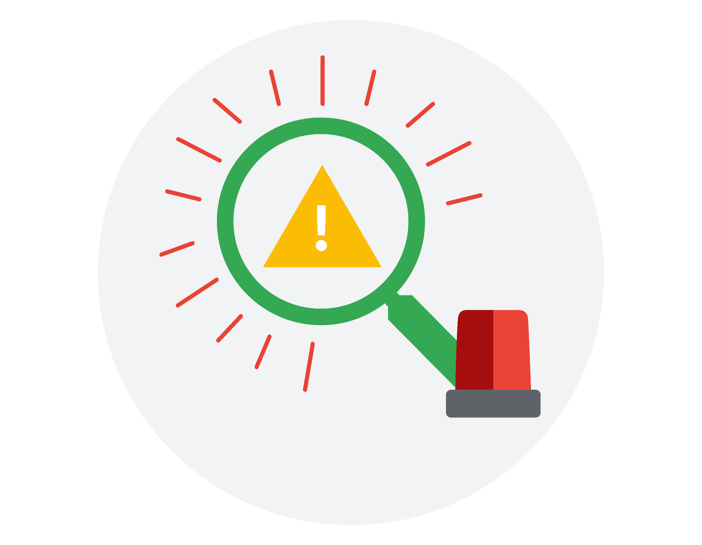

# 03 Incident Handler Journal

Incident handler's journal

Instructions

As you continue through this course, you may use this template to record your findings after completing an activity or to take notes on what you've learned about a specific tool or concept. You can also use this journal as a way to log the key takeaways about the different cybersecurity tools or concepts you encounter in this course.

| Date: 8/12/2026 | Entry: 1 |
| --- | --- |
| Description | This entry is about the security incident that happened at a small healthcare clinic on Tuesday morning at approximately 9:00 a.m. |
| Tool(s) used | N/A |
| The 5 W's | Capture the 5 W's of an incident. Who caused the incident? -An organized group of unethical hackers who are known to target healthcare and transportation organizations What happened? -Several employees reported that they cannot access their medical records files and software. Because of this, their business operations shut down. They got a ransomware attack by unethical hackers that accessed their company’s network by using targeted phishing emails that targeted several employees of the company. It contained malicious attachment that installed malware on their computer once it was downloaded. Once they gained access, they deployed the ransomware which encrypted critical files causing disruptions on availability of their business operations. This resulted in the company being forced to shut down their computer systems and contacted several organizations to report incident and receive technical assistance. When did the incident occur? -On a Tuesday morning at approximately 9:00 a.m. Where did the incident happen? -At a small U.S. health care clinic Why did the incident happen? -This happened because employees got tricked into opening malicious phishing emails that resulted in unethical hackers gaining access to the company’s network. Their motivation is financial because they left a note that they are demanding a large amount of money. |
| Additional notes | How can the company prevent this security incident from happening again? |

| Date: 8/20/2026 | Entry: #2 |
| --- | --- |
| Description | This entry is about the phishing alert about a suspicious file being downloaded on an employee's computer I received as an L1 analyst in a financial services company. |
| Tool(s) used | VirusTotal |
| The 5 W's | Capture the 5 W's of an incident. Who caused the incident? -The sender, Def Communications with an email address “76tguyhh6tgftrt7tg.su” and IP address of “114.114.114.114” What happened? -There is a suspicious file that is being downloaded on an employee’s computer that triggered a phishing alert. The email contained signs that it is malicious including inconsistencies, grammatical errors, and malicious file attachment. I escalated it to the L2 SOC analyst for further action. When did the incident occur? -no details Where did the incident happen? -At a financial services company Why did the incident happen? -The incident happened because the attacker sent a phishing email that contained malware. The employee may have clicked the malicious attachment inside that resulted in the malware being downloaded on the employee’s computer. |
| Additional notes | How can the employee avoid clicking phishing emails again? How can the employee differentiate phishing emails to legit ones? |

| Date: Record the date of the journal entry. | Entry: #3 |
| --- | --- |
| Description | Provide a brief description about the journal entry. |
| Tool(s) used | List any cybersecurity tools that were used. |
| The 5 W's | Capture the 5 W's of an incident. Who caused the incident? What happened? When did the incident occur? Where did the incident happen? Why did the incident happen? |
| Additional notes | Include any additional thoughts, questions, or findings. |

| Date: Record the date of the journal entry. | Entry: Record the journal entry number. |
| --- | --- |
| Description | Provide a brief description about the journal entry. |
| Tool(s) used | List any cybersecurity tools that were used. |
| The 5 W's | Capture the 5 W's of an incident. Who caused the incident? What happened? When did the incident occur? Where did the incident happen? Why did the incident happen? |
| Additional notes | Include any additional thoughts, questions, or findings. |

| Date: Record the date of the journal entry. | Entry: Record the journal entry number. |
| --- | --- |
| Description | Provide a brief description about the journal entry. |
| Tool(s) used | List any cybersecurity tools that were used. |
| The 5 W's | Capture the 5 W's of an incident. Who caused the incident? What happened? When did the incident occur? Where did the incident happen? Why did the incident happen? |
| Additional notes | Include any additional thoughts, questions, or findings. |

| Date: Record the date of the journal entry. | Entry: Record the journal entry number. |
| --- | --- |
| Description | Provide a brief description about the journal entry. |
| Tool(s) used | List any cybersecurity tools that were used. |
| The 5 W's | Capture the 5 W's of an incident. Who caused the incident? What happened? When did the incident occur? Where did the incident happen? Why did the incident happen? |
| Additional notes | Include any additional thoughts, questions, or findings. |

#### Need another journal entry template?

If you want to add more journal entries, please copy one of the tables above and paste it into the template to use for future entries.

| Reflections/Notes: Record additional notes. |
| --- |
