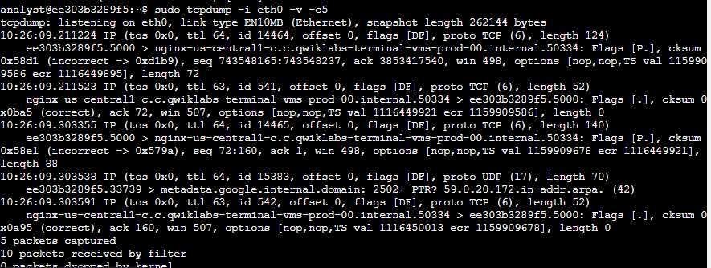
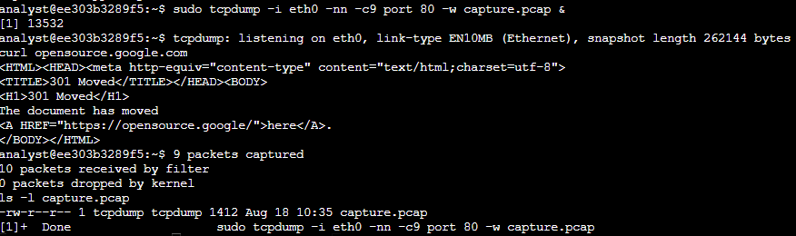

# 05 Tcpdump

Activity: Capture your first packet

In this lab activity, you’ll perform tasks associated with using tcpdump to capture network traffic. You’ll capture the data in a packet capture (p-cap) file and then examine the contents of the captured packet data to focus on specific types of traffic.

Use tcpdump to identify the interface options available for packet capture:

**sudo**** ****tcpdump**** -D**

**Inspect the network traffic of a network interface with ****tcpdump**

Filter live network packet data from the eth0 interface with tcpdump:

sudo tcpdump -i eth0 -v -c5

-i eth0: Capture data specifically from the eth0 interface.

-v: Display detailed packet data.

-c5: Capture 5 packets of data.

DETAILS:

n the example data at the start of the packet output, tcpdump reported that it was listening on the eth0 interface, and it provided information on the link type and the capture size in bytes:

tcpdump: listening on eth0, link-type EN10MB (Ethernet), capture size 262144 bytes

On the next line, the first field is the packet's timestamp, followed by the protocol type, IP:

22:24:18.910372 IP

The verbose option, -v, has provided more details about the IP packet fields, such as TOS, TTL, offset, flags, internal protocol type (in this case, TCP (6)), and the length of the outer IP packet in bytes:

(tos 0x0, ttl 64, id 5802, offset 0, flags [DF], proto TCP (6), length 134)

The specific details about these fields are beyond the scope of this lab. But you should know that these are properties that relate to the IP network packet.

In the next section, the data shows the systems that are communicating with each other:

7acb26dc1f44.5000 > nginx-us-east1-c.c.qwiklabs-terminal-vms-prod-00.internal.59788:

By default, tcpdump will convert IP addresses into names, as in the screenshot. The name of your Linux virtual machine, also included in the command prompt, appears here as the source for one packet and the destination for the second packet. In your live data, the name will be a different set of letters and numbers.

The direction of the arrow (>) indicates the direction of the traffic flow in this packet. Each system name includes a suffix with the port number (.5000 in the screenshot), which is used by the source and the destination systems for this packet.

The remaining data filters the header data for the inner TCP packet:

Flags [P.], cksum 0x5851 (incorrect > 0x30d3), seq 1080713945:1080714027, ack 62760789, win 501, options [nop,nop,TS val 1017464119 ecr 3001513453], length 82

The flags field identifies TCP flags. In this case, the P represents the push flag and the period indicates it's an ACK flag. This means the packet is pushing out data.

The next field is the TCP checksum value, which is used for detecting errors in the data.

This section also includes the sequence and acknowledgment numbers, the window size, and the length of the inner TCP packet in bytes.

**Capture network traffic with ****tcpdump**

Capture packet data into a file called capture.pcap:

**sudo**** ****tcpdump**** -****i**** eth0 -****nn**** -c9 port 80 -w ****capture.pcap**** &**

-i eth0: Capture data from the eth0 interface.

-nn: Do not attempt to resolve IP addresses or ports to names.This is best practice from a security perspective, as the lookup data may not be valid. It also prevents malicious actors from being alerted to an investigation.

-c9: Capture 9 packets of data and then exit.

port 80: Filter only port 80 traffic. This is the default HTTP port.

-w capture.pcap: Save the captured data to the named file.

&: This is an instruction to the Bash shell to run the command in the background.

Use curl to generate some HTTP (port 80) traffic:

curl opensource.google.com

When the curl command is used like this to open a website, it generates some HTTP (TCP port 80) traffic that can be captured.

Verify that packet data has been captured:

ls -l capture.pcap

**Filter the captured packet data**

Use the tcpdump command to filter the packet header data from the capture.pcap capture file:

**sudo**** ****tcpdump**** -****nn**** -r ****capture.pcap**** -v**

This command will run tcpdump with the following options:

-nn: Disable port and protocol name lookup.

-r: Read capture data from the named file.

-v: Display detailed packet data.

What command would you use to capture 3 packets on any interface with the verbose option?

sudo tcpdump -c3 -i any -v

What does the -i option indicate?

The network interface to monitor

What type of information does the -v option include?

Verbose information

What tcpdump command can you use to identify the interfaces that are available to perform a packet capture on?

sudo tcpdump -D

You have gained practical experience to enable you to

identify network interfaces,

use the tcpdump command to capture network data for inspection,

interpret the information that tcpdump outputs regarding a packet, and

save and load packet data for later analysis.
