# 06 Wireshark

**Activity: Analyze your first packet**

In this scenario, you’re a security analyst investigating traffic to a website.

You’ll analyze a network packet capture file that contains traffic data related to a user connecting to an internet site. The ability to filter network traffic using packet sniffers to gather relevant information is an essential skill as a security analyst.

You must filter the data in order to:

identify the source and destination IP addresses involved in this web browsing session,

examine the protocols that are used when the user makes the connection to the website, and

analyze some of the data packets to identify the type of information sent and received by the systems that connect to each other when the network data is captured.

I was given with this .pcap file named sample.pcap

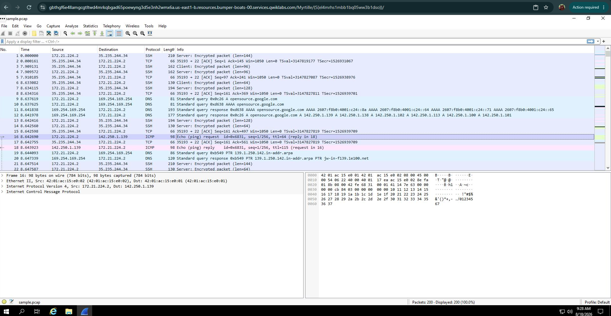

Question:

Scroll down the packet list until a packet is listed where the info column starts with the words 'Echo (ping) request'.

**Answer: ICMP**

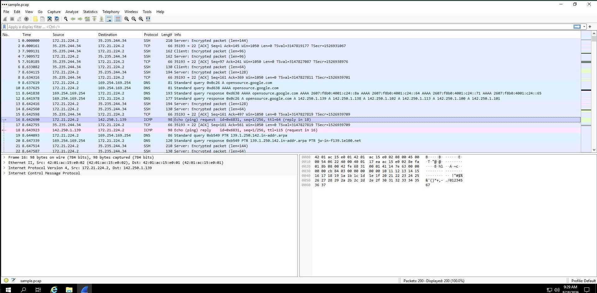

**Task 2. Apply a basic Wireshark filter and inspect a packet**

Enter the following filter for traffic associated with a specific IP address. Enter this into the Apply a display filter... text box immediately above the list of packets:

ip.addr == 142.250.1.139

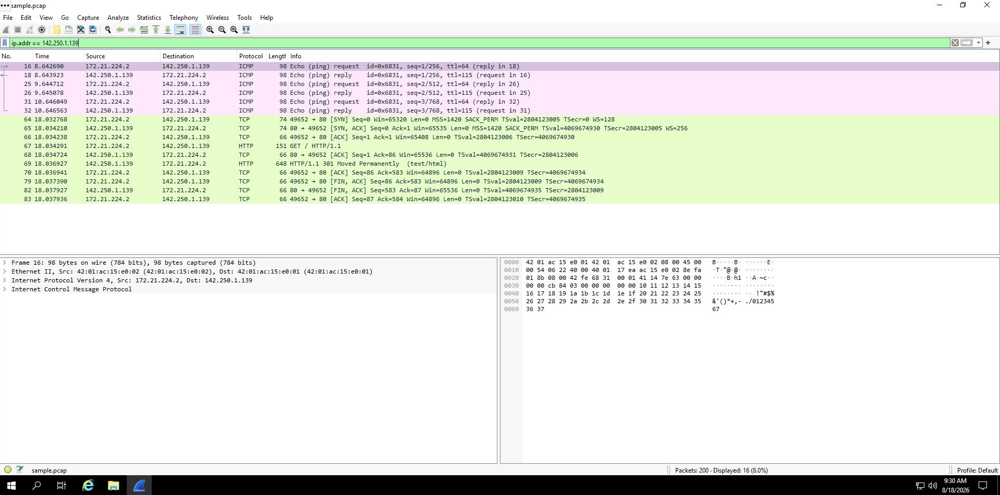

The list of packets displayed is now significantly reduced and contains only packets where either the source or the destination IP address matches the address you entered. Now only two packet colors are used: light pink for ICMP protocol packets and light green for TCP (and HTTP, which is a subset of TCP) packets.

Double-click the first packet that lists TCP as the protocol.

This opens a packet details pane window:

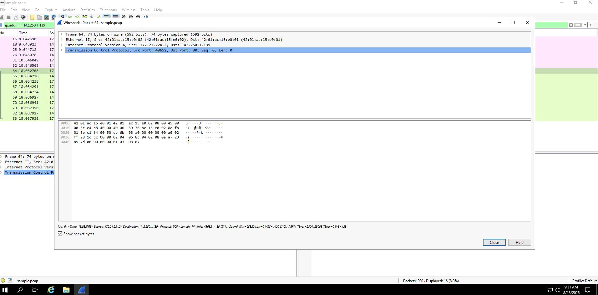

The upper section of this window contains subtrees where Wireshark will provide you with an analysis of the various parts of the network packet. The lower section of the window contains the raw packet data displayed in hexadecimal and ASCII text. There is also placeholder text for fields where the character data does not apply, as indicated by the dot (“.”).

Note: The details pane is located at the bottom portion of the main Wireshark window. It can also be accessed in a new window by double clicking a packet.

Double-click the first subtree in the upper section. This starts with the word Frame.

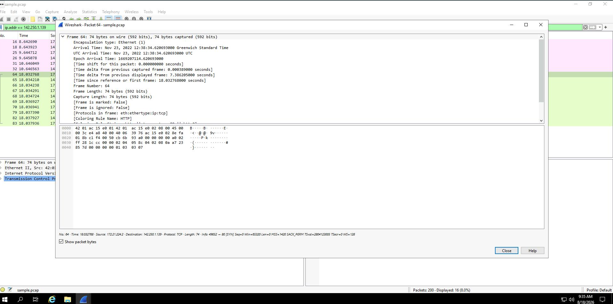

This provides you with details about the overall network packet, or frame, including the frame length and the arrival time of the packet. At this level, you’re viewing information about the entire packet of data.

Double-click Frame again to collapse the subtree and then double-click the Ethernet II subtree.

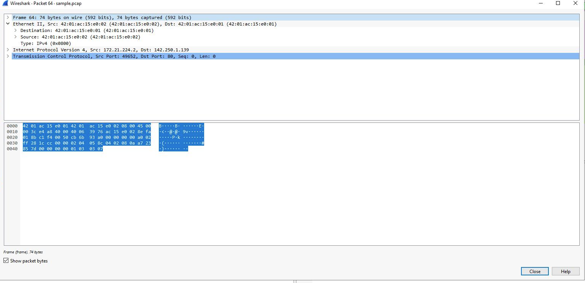

This item contains details about the packet at the Ethernet level, including the source and destination MAC addresses and the type of internal protocol that the Ethernet packet contains.

Double-click Ethernet II again to collapse that subtree and then double-click the Internet Protocol Version 4 subtree.

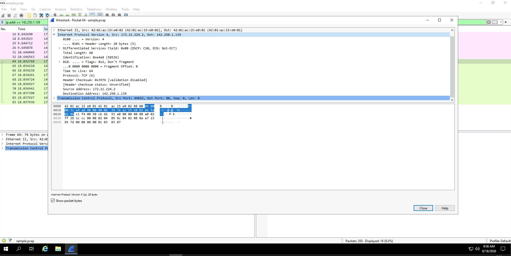

This provides packet data about the Internet Protocol (IP) data contained in the Ethernet packet. It contains information such as the source and destination IP addresses and the Internal Protocol (for example, TCP or UDP), which is carried inside the IP packet.

Note: The Internet Protocol Version 4 subtree is Internet Protocol Version 4 (IPv4). The third subtree label reflects the protocol.

The source and destination IP addresses shown here match the source and destination IP addresses in the summary display for this packet in the main Wireshark window.

Double-click Internet Protocol Version 4 again to collapse that subtree and then double-click the Transmission Control Protocol subtree.

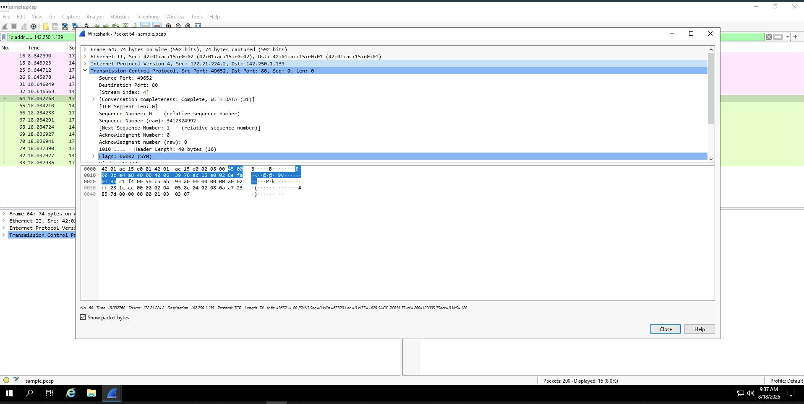

This provides detailed information about the TCP packet, including the source and destination TCP ports, the TCP sequence numbers, and the TCP flags.

The source port and destination port listed here match the source and destination ports in the info column of the summary display for this packet in the list of all of the packets in the main Wireshark window.

**Question:**

What is the TCP destination port of this TCP packet?

Answer: 80

In the Transmission Control Protocol subtree, scroll down and double-click Flags.

This provides a detailed view of the TCP flags set in this packet.

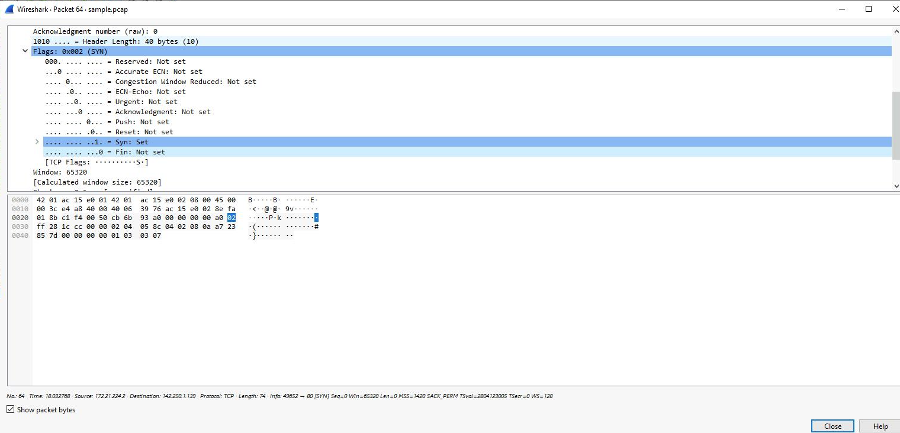

Enter the following filter to select traffic for a specific source IP address only. Enter this into the Apply a display filter... text box immediately above the list of packets:

ip.src == 142.250.1.139

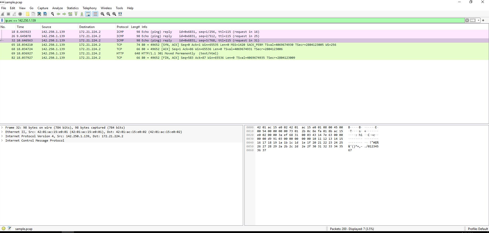

Enter the following filter to select traffic for a specific destination IP address only:

ip.dst == 142.250.1.139

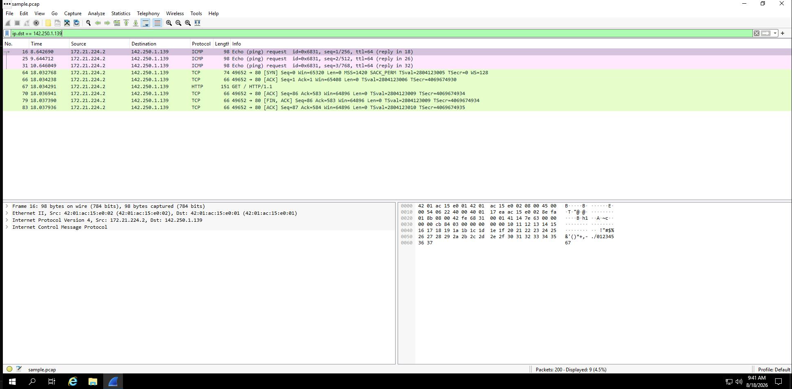

Enter the following filter to select traffic to or from a specific Ethernet MAC address. This filters traffic related to one MAC address, regardless of the other protocols involved:

eth.addr == 42:01:ac:15:e0:02

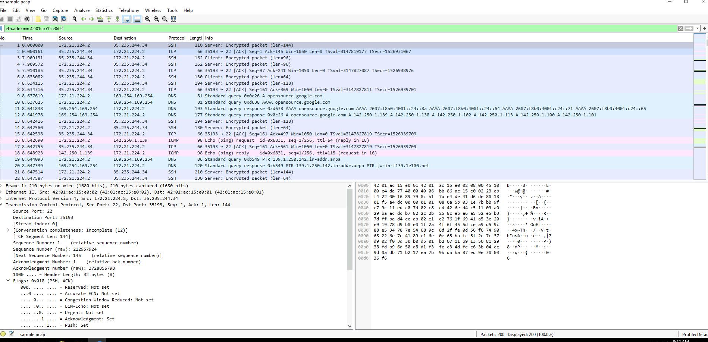

Question:

What is the protocol contained in the Internet Protocol Version 4 subtree from the first packet related to MAC address 42:01:ac:15:e0:02?

Answer: TCP (6)

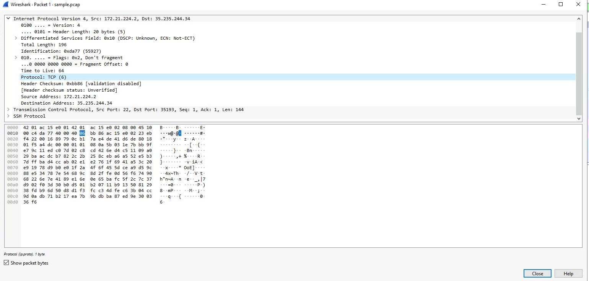

**Task 4. Use filters to explore DNS packets**

Enter the following filter to select UDP port 53 traffic. DNS traffic uses UDP port 53, so this will list traffic related to DNS queries and responses only. Enter this into the Apply a display filter... text box immediately above the list of packets:

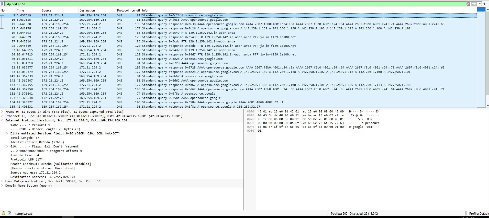

Question: Which of these IP addresses is displayed in the expanded Answers section for the DNS query for opensource.google.com?

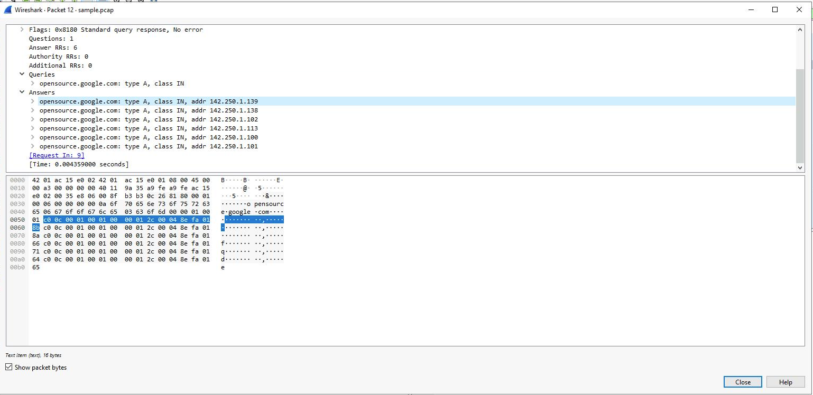

**Task 5. Use filters to explore TCP packets**

In this task, you’ll use additional filters to select and examine TCP packets. You’ll learn how to search for text that is present in payload data contained inside network packets. This will locate packets based on something such as a name or some other text that is of interest to you.

Enter the following filter to select TCP port 80 traffic. TCP port 80 is the default port that is associated with web traffic:

tcp.port eq 80

Double-click the first packet in the list. The Destination IP address of this packet is 169.254.169.254.

Question: What is the Time to Live value of the packet as specified in the Internet Protocol Version 4 subtree?

64

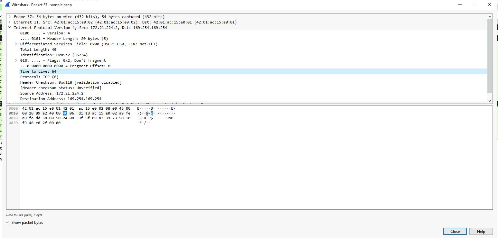

What is the Frame Length of the packet as specified in the Frame subtree? 54 bytes

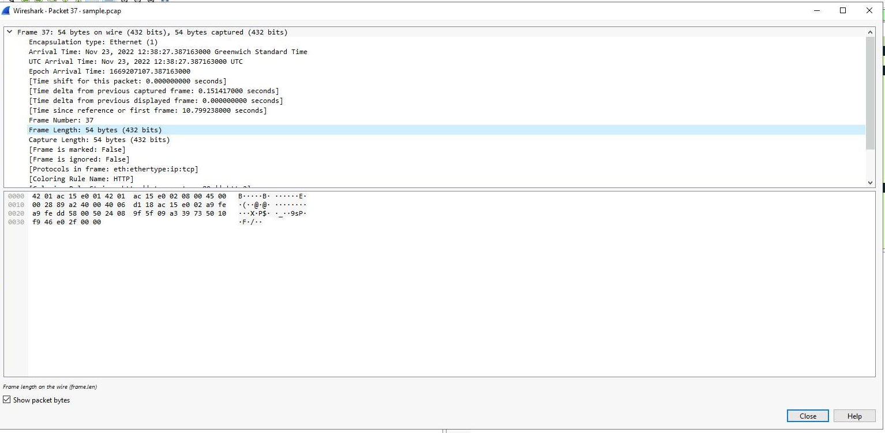

What is the Header Length of the packet as specified in the Internet Protocol Version 4 subtree? 20 bytes

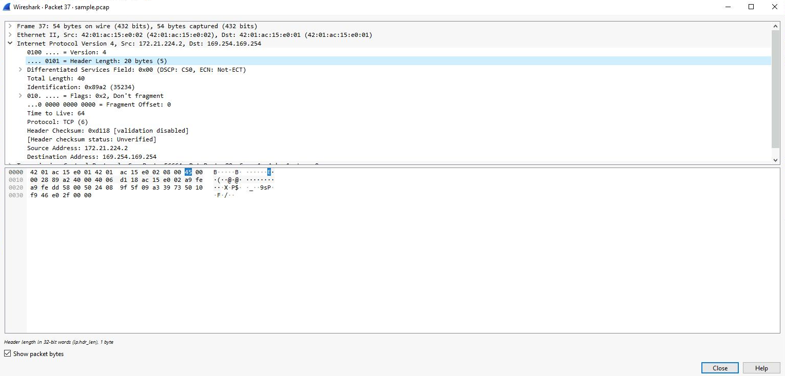

What is the Destination Address as specified in the Internet Protocol Version 4 subtree? 169.254.169.254

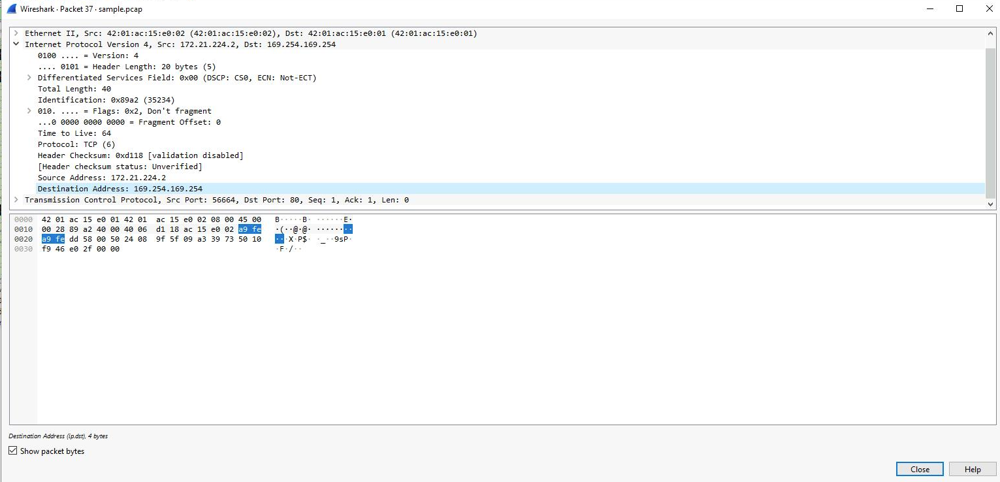

Enter the following filter to select TCP packet data that contains specific text data.

tcp contains "curl"

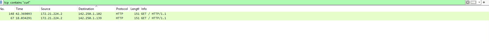

You now have practical experience using Wireshark to

open saved packet capture files,

view high-level packet data, and

use filters to inspect detailed packet data.
