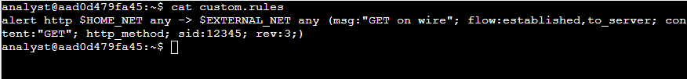
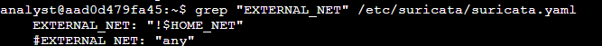
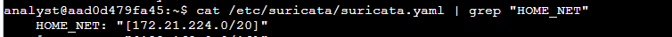
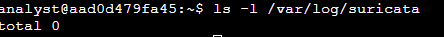
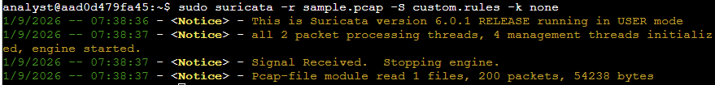
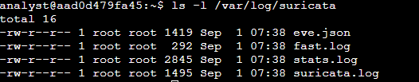
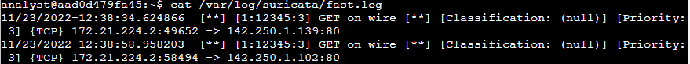
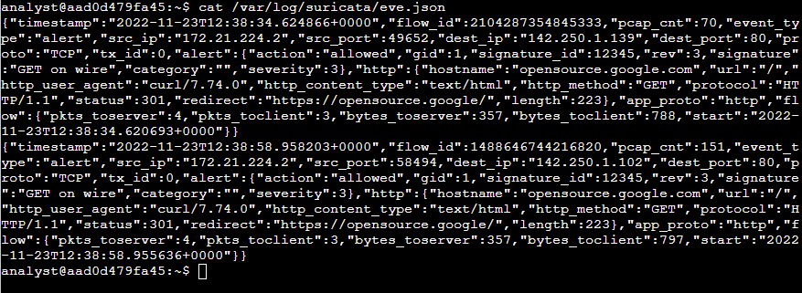
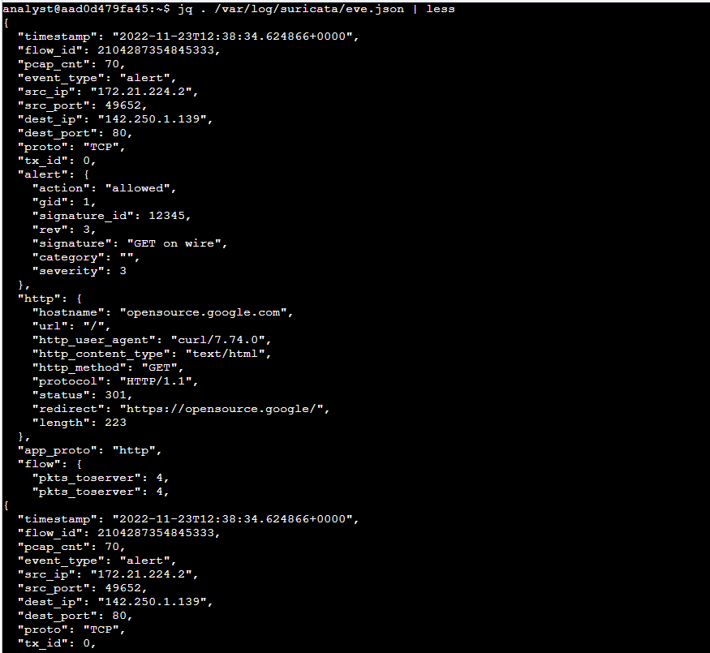
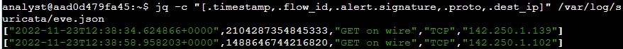

# 07 Suricata

Activity: Examine alerts, logs, and rules with Suricata

You’ll examine a rule and practice using Suricata to trigger alerts on network traffic. You’ll also analyze log outputs, such as a fast.log and eve.json file. This will help you understand some of the alerts and logs generated by Suricata.

First, you'll explore custom rules in Suricata. Second, you'll run Suricata with a custom rule in order to trigger it, and examine the output logs in the fast.log file. Finally, you’ll examine the additional output that Suricata generates in the standard eve.json log file.

I’ve been given with two files which are custom.rules and sample.pcap

After opening the custom.rules file. I saw a signature that contains an alert action. The header includes http protocol, source ($HOME_NET) and destination IP address ($EXTERNAL_NET), source and destination ports (both any), and traffic direction (->).Next, the rule options contain a message (“GET on wire”), flow, content (Check if there is GET option in the http method), http_method, sid of the rule, and rev(version 3).

In this lab, the src ip address is 172.21.224.0/20 and dest ip address is any ip address except the source IP address.

I noticed that there are no logs before running the suricata

I ran the suricata as sudo. It reads the sample.pcap file, uses the custom rules in custom.rules file and disable checksum checks.

After running the suricata, I noticed that there are now four log files in /var/log/suricata.

Based on the logs in fast.log file, each line corresponds to an alert generated by Suricata when it processed a packet that meets the conditions of the alert rule. It contains the message, source, destination, and direction of the traffic.

I also opened the eve.json file which contains a lot more detail compared to fast.log. But it is hard to read as there is continuous line, so I used this command “jq . /var/log/suricata/eve.json | less” so it would be easy for me to read the log.

What is the value of the severity property for the first alert returned by the jq command?

Answer: 3. Based on the first alert in the log file.

Here I used this command “jq -c "[.timestamp,.flow_id,.alert.signature,.proto,.dest_ip]" /var/log/suricata/eve.json” to extract certain fields only.

What is the destination IP address listed for the last event in the 'eve.json' file?

A: 142.250.1.102

What is the alert signature for the first alert entry in the 'eve.json' file? A: Get on Wire
